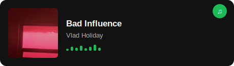

# Hi there, I'm Daniel Cárdenas 👋

## I'm a Computer Science Student & Self-Taught Backend Developer

- 👨‍💻 I'm currently building backend systems and web applications
- 📚 I'm constantly learning backend technologies, cloud infrastructure, and software architecture
- 💪🏼 Future Goals: Build scalable systems and keep growing as a software engineer

---

### Spotify 🎧

---

### Contact with me 📝

 

---

### Languages and Tools 🛠

 

---

<h2 align="center"> Github Statistics 📈 </h2>

 
  
  

